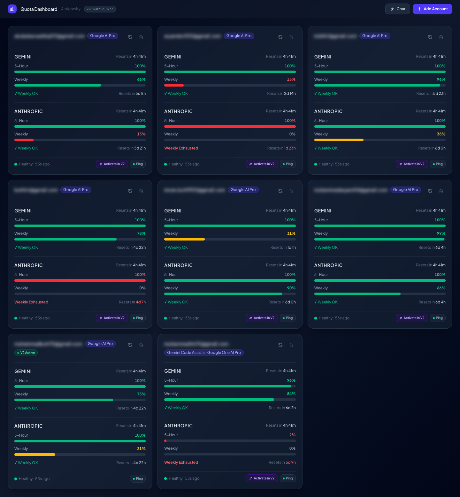
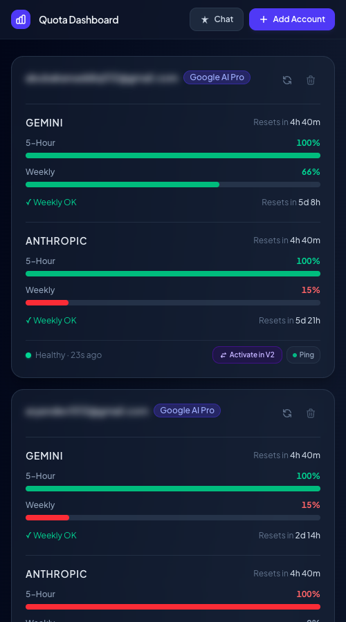
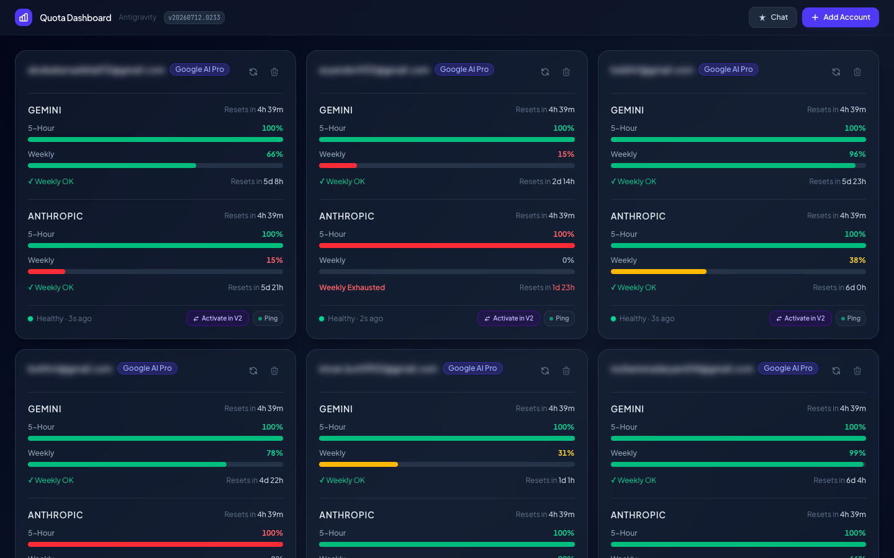
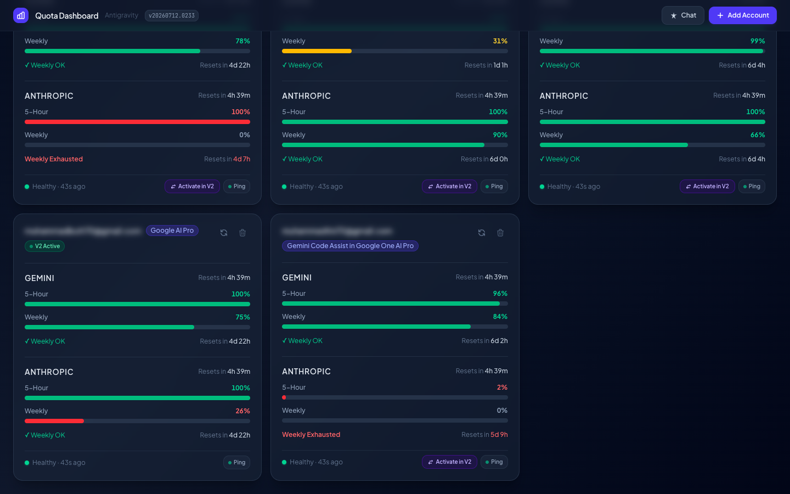
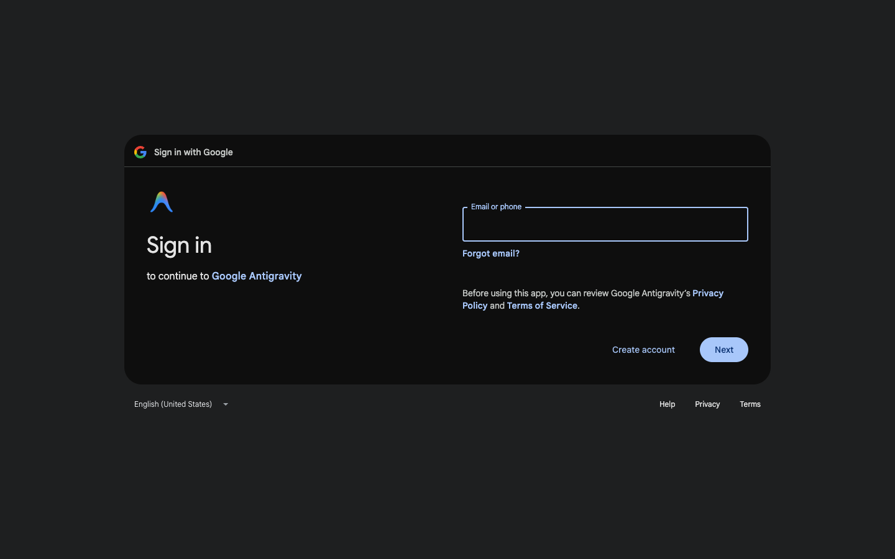
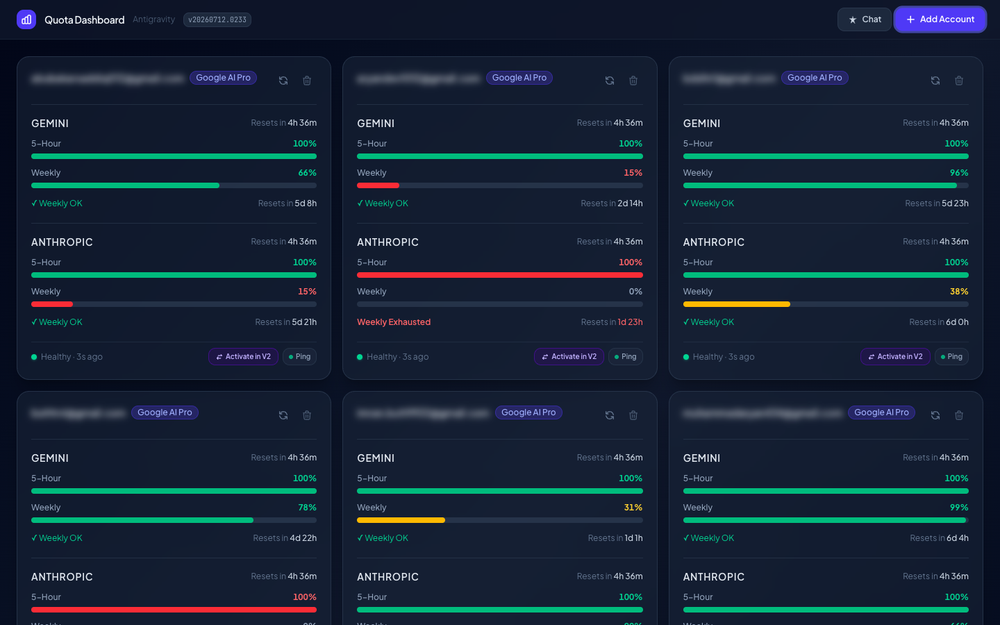
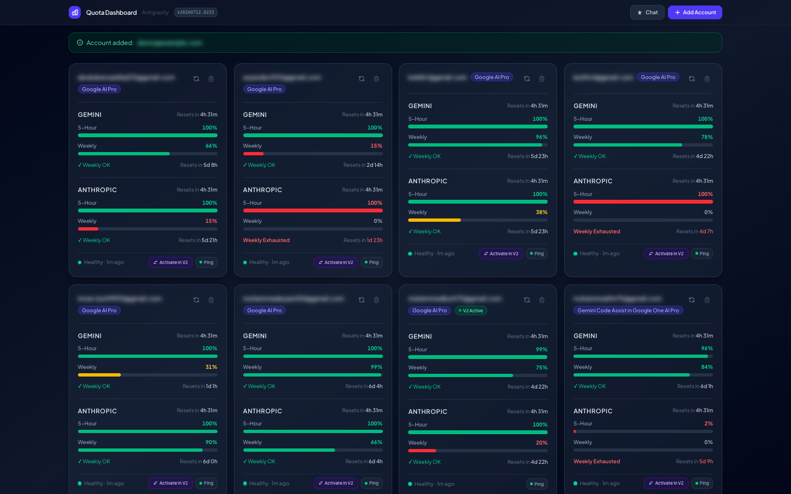

<div align="center">



# Multigravity Elysium

**A personal, self-hosted dashboard to monitor AI quota usage across any number of Google accounts — Gemini and Anthropic pools, 5-hour and weekly windows, live reset countdowns, and health status at a glance.**

<!-- Tech stack badges -->
[](https://nextjs.org/)
[](https://react.dev/)
[](https://www.typescriptlang.org/)
[](https://tailwindcss.com/)
[](https://www.prisma.io/)
[](https://sqlite.org/)

<!-- GitHub stats badges -->
[](https://github.com/mbl9898/multigravity-elysium/stargazers)
[](https://github.com/mbl9898/multigravity-elysium/network/members)
[](https://github.com/mbl9898/multigravity-elysium/issues)
[](https://github.com/mbl9898/multigravity-elysium/commits/main)
[](LICENSE)

<!-- Visitor counter (auto-increments on every README view) -->
[](https://hits.seeyoufarm.com)

<!-- Clone counter — powered by .github/workflows/clone-counter.yml + a GitHub Gist -->
[](https://github.com/mbl9898/multigravity-elysium)

</div>

---

## What Is This?

Google's AI platform assigns quota to each account in two independent pools — **Gemini** and **Anthropic** — with two separate windows:

| Window | Duration | Resets |
|--------|----------|--------|
| **5-Hour** | Rolling 5-hour window | Automatically, per your usage |
| **Weekly** | 7-day calendar window | Every Monday |

If you use multiple Google accounts for AI (whether through [Antigravity IDE](https://idx.google.com/), [AI Studio](https://aistudio.google.com/), or any other Google AI product), tracking which account still has remaining quota requires logging in and out of each — tedious and slow. This dashboard solves that by showing **every account's quota state at a glance**, updating automatically every 60 seconds.

> **Scope**: This is a **personal monitoring tool only**. It does not proxy requests, route traffic, load-balance, or act as a Claude/Gemini API adapter. Its single responsibility is to display quota information across your accounts.

---

## Features

### 📊 Multi-Account Dashboard

Connect any number of Google accounts. Each gets its own card showing live quota data, refreshed automatically every 60 seconds.

---

### 🃏 Account Cards

Each card shows at a glance:
- **Account email** (blurred in screenshots for privacy)
- **Subscription tier** (Free / Google AI Pro / Gemini Code Assist / etc.)
- **Gemini pool** — 5-Hour % remaining + Weekly % remaining + reset countdown
- **Anthropic pool** — same layout
- **Health status** dot (green = healthy, amber = degraded, red = error)
- **Last updated** timestamp
- Action buttons: Refresh · Ping · Delete  _(+ Activate in Antigravity V2, if you use the IDE)_



---

### 🟥 Weekly Exhausted State

When an account's weekly Anthropic or Gemini quota is exhausted, the card immediately reflects it with a **red "Weekly Exhausted"** label and a countdown to the weekly reset.



---

### 🟢 Antigravity V2 Integration _(Optional)_

If you use [Antigravity IDE](https://idx.google.com/), the **"Activate in V2"** button lets you switch the active AI account inside the IDE directly from this dashboard — without ever reopening it. The active account displays a pulsing **V2 Active** green badge.

This feature is **entirely optional** — the dashboard works fully without it for anyone using Google AI Studio or other Google AI products.



---

### 🔐 Secure Google OAuth Login

Click **+ Add Account** to start a PKCE-secured OAuth flow. You're redirected to the real Google sign-in page. **Any Google account** with Google AI Studio / Gemini access can be added — no special software or subscription required. Only a refresh token is stored, encrypted with AES-256-GCM. No credentials ever touch this app's server.



---

### ⚡ Ping Button

The **Ping** button sends a minimal request to start (or restart) the 5-hour countdown window for that account. The dot on the button shows the ping state:
- 🟢 **Green** — countdown is active (< 5h since last ping)
- 🟡 **Amber** — countdown may have expired
- 🔴 **Red** — last ping failed
- ⚫ **Gray** — never pinged

---

## Tech Stack

| Layer | Technology |
|-------|-----------|
| **Framework** | [Next.js 16](https://nextjs.org/) (App Router, Server Components) |
| **Language** | [TypeScript 5](https://www.typescriptlang.org/) |
| **UI** | [React 19](https://react.dev/) |
| **Styling** | [Tailwind CSS v4](https://tailwindcss.com/) + [tw-animate-css](https://github.com/Wombosvideo/tw-animate-css) |
| **Component Library** | [shadcn/ui](https://ui.shadcn.com/) (Radix UI primitives) |
| **Icons** | [Lucide React](https://lucide.dev/) |
| **Server State** | [TanStack Query v5](https://tanstack.com/query/latest) |
| **Database** | [SQLite](https://sqlite.org/) (local file) |
| **ORM** | [Prisma 7](https://www.prisma.io/) with `@libsql/client` |
| **Scheduler** | [node-cron](https://github.com/node-cron/node-cron) (in-process, 60s interval) |
| **Encryption** | Node.js `crypto` — AES-256-GCM for stored refresh tokens |
| **Authentication** | Google OAuth 2.0 + PKCE (S256) |
| **Fonts** | [Plus Jakarta Sans](https://fonts.google.com/specimen/Plus+Jakarta+Sans) + [JetBrains Mono](https://fonts.google.com/specimen/JetBrains+Mono) |

---

## Architecture

```
multigravity-elysium/
├── src/
│   ├── app/
│   │   ├── api/
│   │   │   ├── accounts/         ← CRUD for stored accounts
│   │   │   ├── auth/
│   │   │   │   ├── login/        ← Initiates OAuth + PKCE flow
│   │   │   │   └── callback/     ← Handles Google redirect
│   │   │   ├── quota/            ← Manual quota refresh per account
│   │   │   └── v2/switch-account ← Server-side V2 account switching
│   │   ├── chat/                 ← Chat interface (bonus feature)
│   │   ├── layout.tsx
│   │   └── page.tsx              ← Root dashboard page
│   ├── components/
│   │   ├── AccountCard.tsx       ← Per-account card with quota display
│   │   ├── Dashboard.tsx         ← Grid of AccountCards + TanStack Query
│   │   ├── QuotaBar.tsx          ← Colored progress bar (green/amber/red)
│   │   ├── CountdownTimer.tsx    ← Live countdown to quota reset
│   │   └── QueryProvider.tsx     ← TanStack Query provider wrapper
│   ├── lib/
│   │   ├── antigravity/
│   │   │   ├── auth.ts           ← OAuth 2.0 + PKCE helpers
│   │   │   ├── quota.ts          ← 5-hour quota API calls
│   │   │   ├── weekly.ts         ← Weekly quota probe logic
│   │   │   ├── ping.ts           ← 5-hour countdown ping
│   │   │   ├── classifier.ts     ← Pool classifier (Gemini / Anthropic)
│   │   │   └── local_ls.ts       ← Import from local Antigravity IDE state
│   │   ├── database/
│   │   │   ├── client.ts         ← Prisma + libsql client singleton
│   │   │   └── accounts.ts       ← Account CRUD (type-safe, server-side)
│   │   ├── encryption/
│   │   │   └── index.ts          ← AES-256-GCM encrypt/decrypt
│   │   └── scheduler/
│   │       └── index.ts          ← node-cron background poller
│   └── types/
│       └── index.ts              ← Shared TypeScript types
├── prisma/
│   ├── schema.prisma             ← Account + OAuthSession models
│   └── migrations/               ← SQLite migration history
└── setup-daemon.sh               ← macOS LaunchAgent setup script
```

### Data Flow

```
Browser (TanStack Query)
  │  polls every 60s
  ▼
Next.js Server (Route Handlers)
  │  decrypts refresh token
  ▼
Google Token Endpoint  ──────────────────────────┐
  │  returns access token (in-memory only)       │
  ▼                                              │
Antigravity API (cloudcode-pa.googleapis.com)   OAuth
  │  returns quota fractions + reset times       │
  ▼                                              │
Prisma → SQLite (local file)                     │
  │  persists encrypted refresh tokens + quota   │
  ▼                                              │
AccountCard UI renders live quota bars ◄─────────┘
```

---

## Running Locally

### Prerequisites

- **Node.js 22+** (`node --version`)
- **npm 10+**
- One or more **Google accounts** with Google AI / Gemini access (AI Studio, Antigravity IDE, Gemini Code Assist, etc.)

### 1. Clone & install

```bash
git clone https://github.com/mbl9898/multigravity-elysium.git
cd multigravity-elysium
npm install
```

### 2. Configure environment

```bash
cp .env.local.example .env.local
```

Open `.env.local` and fill in:

```env
# Generate with:
# node -e "console.log(require('crypto').randomBytes(32).toString('hex'))"
ENCRYPTION_KEY=your_64_char_hex_key_here

# OAuth callback base URL (must match dev port)
NEXT_PUBLIC_APP_URL=http://localhost:39281

# Google OAuth credentials (optional — built-in fallback works out-of-the-box)
# Override here if you want to use your own GCP project's OAuth client.
# Leave blank to use the default credentials bundled with the app.
GOOGLE_CLIENT_ID=
GOOGLE_CLIENT_SECRET=
```

### 3. Set up the database

```bash
npx prisma generate
npx prisma migrate dev
```

### 4. Start the dev server

```bash
npm run dev
```

Open [http://localhost:39281](http://localhost:39281).

---

## Adding Accounts

1. Click **+ Add Account** in the top-right corner of the dashboard.
2. You'll be redirected to Google's sign-in page.
3. Sign in with **any Google account** that has Google AI / Gemini access.
4. You'll be redirected back to the dashboard with a success toast showing the account email.
5. Quota data is fetched automatically within a few seconds.

> Works with **Google AI Studio**, **Antigravity IDE**, **Gemini Code Assist**, and any Google account with Gemini/Anthropic AI quota.

> The refresh token is encrypted with AES-256-GCM before being stored in the local SQLite database. Access tokens are kept **only in server memory** and never persisted.






---

## Running as a macOS Background Service (Daemon)

To have the dashboard start automatically on login and run in the background, run the setup script from the repository root:

```bash
bash setup-daemon.sh
```

### Setup Options (Flags)

The setup script supports the following flags for automated environments or custom preferences:

- **Interactive (Default)**: Prompts you before adding the `quota` terminal alias to your `~/.zshrc`.
- **`--yes` / `-y`**: Accepts all prompts automatically (non-interactive). Useful for script execution or automated setups.
- **`--no-alias`**: Skips the shell shortcut configuration entirely.
- **`--help` / `-h`**: Prints the usage manual and exits.

---

### 🚀 Quick Terminal Launch (`quota` command)

During setup, you'll be prompted to add a shell shortcut to your terminal. Once added (and activated via `source ~/.zshrc`), you can open the dashboard from any terminal window using:

```bash
quota
```

This command runs a companion script (`open-dashboard.sh`) which:
1. Checks if the background daemon is responding on `http://localhost:39281`.
2. Starts the daemon via `launchctl` if it was stopped.
3. Opens the dashboard in your default system browser once it is active.

**Manual daemon commands:**
```bash
# Stop the background service
launchctl unload ~/Library/LaunchAgents/com.multigravity.elysium.plist

# Start the background service manually
launchctl load ~/Library/LaunchAgents/com.multigravity.elysium.plist

# View background logs
tail -f ~/.multigravity-elysium/daemon-stdout.log
tail -f ~/.multigravity-elysium/daemon-stderr.log
```

---

## 📱 Progressive Web App (PWA)

Multigravity Elysium includes full Progressive Web App support to run as a native desktop utility.

- **Branded Install Card**: When opening the dashboard in a browser, an install banner appears at the top.
  - **Chrome / Edge / Chromium**: Displays a single-click **Install App** button to create a standalone OS window.
  - **Safari (macOS)**: Guides you to click **Share** → **Add to Dock** to place a high-resolution, branded icon in your macOS Dock.
  - **iOS Safari / Android**: Displays mobile-specific instructions to add the app to your Home Screen.
- **Standalone Window**: Once installed, the dashboard opens in its own borderless window with no browser search bar or navigation buttons.
- **Background Safety**: The service worker explicitly bypasses caching for `/api/*` routes, guaranteeing you never see stale, cached quota percentages.

---

## 🔌 Offline / Daemon Failure Experience

If the background daemon is ever stopped, the PWA service worker automatically intercepts the page load and serves a branded **Dashboard Unavailable** screen instead of a generic browser connection error.

This page:
- Explains that the background daemon is not running.
- Displays copy-pasteable terminal commands to restart it.
- Features a **Retry Connection** button that automatically refreshes the page once the daemon is active.
- Auto-retries the connection quietly in the background every 10 seconds.

---

## 🤖 Antigravity IDE Integration (AGY Skill)

The repository includes a custom agent skill located in [`.agents/skills/open-quota-dashboard/SKILL.md`](file:///.agents/skills/open-quota-dashboard/SKILL.md).

When pair-programming with an Antigravity AI assistant, you can ask it to:
- *"open my quota"*
- *"check my api limits"*
- *"show me the dashboard"*

The agent will read the skill and run `open-dashboard.sh` to launch the app in your default system browser.


---

## Security & Privacy

- **No telemetry.** This app makes no external requests other than to Google's own OAuth and Google AI quota endpoints.
- **No cloud services.** Everything — the database, tokens, and server — runs locally on your machine.
- **Refresh tokens encrypted at rest** using AES-256-GCM with a key you generate and control (stored in `.env.local`, never committed).
- **Access tokens are ephemeral** — fetched at request time, kept only in server memory, never persisted.
- **Emails never logged.** Account email addresses are stored in SQLite but never written to log files.
- **.env files are gitignored.** The `.gitignore` explicitly excludes `.env`, `.env.local`, and the SQLite database file.

---

## Acknowledgements

This project was built with help from reverse-engineering the Antigravity quota system. The following community projects provided invaluable insights into authentication patterns, quota API endpoints, and reset timer detection — while this dashboard deliberately reuses none of their proxy/routing logic:

| Project | What We Learned |
|---------|----------------|
| [wusimpl/AntigravityQuotaWatcher](https://github.com/wusimpl/AntigravityQuotaWatcher) | PKCE OAuth flow structure and quota API endpoint discovery |
| [Draculabo/AntigravityManager](https://github.com/Draculabo/AntigravityManager) | Token refresh patterns and account persistence approach |
| [n2ns/antigravity-panel](https://github.com/n2ns/antigravity-panel) | Dashboard layout patterns for multi-account display |
| [lbjlaq/Antigravity-Manager](https://github.com/lbjlaq/Antigravity-Manager) | Account management UI patterns |
| [theblazehen/opencode-antigravity-multi-auth](https://github.com/theblazehen/opencode-antigravity-multi-auth) | Multi-account session handling concepts |

> These projects solved different problems (primarily API proxying). This dashboard borrows none of their proxy architecture — only the insights into **how the Antigravity quota API works**.

---

## Deployment (Server)

The app is designed to run locally, but it's straightforward to self-host on a VPS:

```bash
# Example: Ubuntu 24.04 on Hetzner, managed with PM2
npm run build
npx pm2 start npm --name multigravity-elysium -- start
npx pm2 save
npx pm2 startup
```

Use Nginx as a reverse proxy:

```nginx
server {
    listen 80;
    server_name your.domain.com;

    location / {
        proxy_pass http://localhost:39281;
        proxy_http_version 1.1;
        proxy_set_header Upgrade $http_upgrade;
        proxy_set_header Connection 'upgrade';
        proxy_set_header Host $host;
        proxy_cache_bypass $http_upgrade;
    }
}
```

If you later need multi-user support, Prisma makes it easy to migrate from SQLite to PostgreSQL with minimal application changes.

---

## License

This is personal tooling built for private use. Use at your own discretion. No warranty is provided.

> **Note:** This tool interacts with Google's internal AI quota API endpoints (`cloudcode-pa.googleapis.com`). These are undocumented and may change without notice. The app surfaces "last successful check" timestamps so you always know if data is stale.
