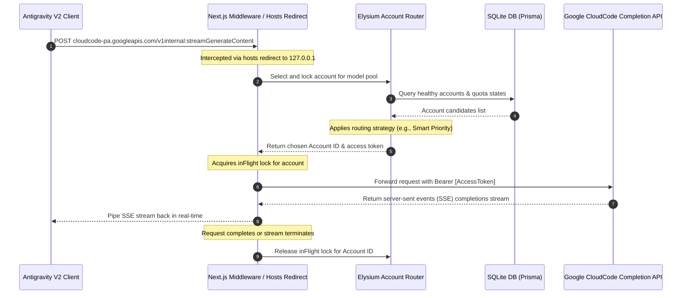

# Multigravity Elysium — Aggregated Quota Pool Feature Documentation

The **Aggregated Quota Pool** is the backend execution gateway of Multigravity Elysium. It acts as a local quota-aware Man-in-the-Middle (MITM) proxy that intercepts AI model completion and agent requests from clients (such as the standalone Antigravity V2 application or the Antigravity IDE language server) and routes them across a pool of connected Google accounts to maximize overall quota utilization.

---

## 1. System Architecture & Request Flow

The gateway operates on a pass-through interception model. Outgoing requests to Google's completions endpoints are rerouted locally, dynamically mapped to the most suitable account, injected with fresh credentials, and piped back to the client.

### Interception & Routing Architecture


### Key Files Involved:
*   [src/proxy.ts](src/proxy.ts): Next.js middleware acting as the main routing interceptor. It rewrites matched completion paths (e.g., `/v1internal:streamGenerateContent` or `/v1/models/*`) to the local gateway routes.
*   [src/lib/router/accountRouter.ts](src/lib/router/accountRouter.ts): Governs the core gateway business logic—loading settings, filtering candidate accounts, executing selection algorithms, managing the `inFlight` lock status, and caching Google access tokens.
*   [src/app/api/v1internal/stream-generate-content/route.ts](src/app/api/v1internal/stream-generate-content/route.ts): Handles intercepted CloudCode autocomplete requests, selects/locks an account, manages rate-limit retries, and streams responses directly back.
*   [src/components/RoutingStrategyDrawer.tsx](src/components/RoutingStrategyDrawer.tsx): A sliding settings panel rendered in the dashboard header that allows users to configure the active routing mode.

---

## 2. Core Feature Components

### A. Routing Strategies
Elysium supports four routing strategies to govern how requests are distributed:

| Strategy | Icon | Selection Logic | Best Use Case |
| :--- | :--- | :--- | :--- |
| **Smart Priority** | 🧠 | Prioritizes perishable weekly quota that is $\le$ 2 days away from resetting. Falls back to round-robin. | Default mode. Maximizes overall quota utilization and prevents expiration waste. |
| **Round Robin** | 🔄 | Distributes requests equally across all healthy accounts using alphabetical email sorting. | Evenly distributes load across all accounts. |
| **Locked Account** | 🔒 | Pins all traffic to a single specific account. Fails with an error if that account is exhausted. | Testing or dedicating resources to a single premium subscription. |
| **Custom Pool** | 🎛 | Restricts rotation to a manually selected subset of accounts, running round-robin within them. | Restricting usage to a set of accounts while keeping others in reserve. |

### B. Concurrency Backpressure (`inFlight` Locks)
To prevent rate-limiting and double-booking, the router maintains an in-memory `inFlight` Set of active Account IDs. 
*   When an account is selected by `selectAndLockAccount()`, its ID is locked in memory.
*   While locked, it is omitted from the available candidates pool.
*   Once the response stream terminates (either naturally, due to an error, or from a client-abort), `releaseAccount()` deletes the ID from the set, allowing it to serve subsequent requests.

### C. Token Pre-Warming & Lazy Cache
To prevent the gateway from blocking on slow Google OAuth token-refresh roundtrips during completion hot-paths:
*   **Lazy Cache**: Access tokens are stored in an in-memory map `tokenCache` with a 55-minute expiry.
*   **Pre-Warming**: The background scheduler runs `preWarmTokenCache()` every 60 seconds. It automatically refreshes any cached tokens expiring in less than 5 minutes for healthy accounts, ensuring instant completion responses.

---

## 3. Implementation History (Detailed Development Milestones)

### Milestone 1: Gateway Architecture & Multi-Account Routing Setup
*   **Goal**: Establish the local completions endpoint proxy and pool accounts to serve requests.
*   **Details**:
    *   Implemented `src/lib/router/accountRouter.ts` supporting the four routing modes.
    *   Set up local DNS mapping for `cloudcode-pa.googleapis.com` pointing to `127.0.0.1`.
    *   Deployed `mitm_gateway.js` (on port 443) and `mitmdump` with `mitm_addon.py` (on port 8080) to capture outbound calls and rewrite `Authorization` headers on the fly.
    *   Constructed the Next.js API endpoints (`/api/v1/chat/completions` and `/api/v1/messages`) to provide OpenAI and Anthropic compatible interfaces.

---

### Milestone 2: Fix Claude Sonnet 4.6 Quota Redirection Failure
*   **Goal**: Fix the issue where Claude Sonnet 4.6 requests from the Antigravity v2 standalone application's modeling/agent thread failed with `"Agent execution terminated due to error"` instead of utilizing the Elysium account pool.

#### Root Cause Analysis
We investigated the system and process configuration and discovered the following:
1.  **Model Redirection Configuration**: When the language server runs Claude requests, it overrides the normal domain endpoint and redirects all requests to `ANTHROPIC_BASE_URL=http://127.0.0.1:18081` using a dummy API key.
2.  **Local Python Proxy**: Listening on port `18081` is a local Python proxy script that bridges Claude API requests to the local Elysium gateway.
3.  **Incorrect Upstream Gateway URL**: This Python proxy is launched automatically via a local LaunchAgent. However, it was started with `--gateway-url http://127.0.0.1:8787`. Port `8787` is currently dead (no process is listening on it).
4.  **Model Mapping Issue**: In the Python proxy script, all Claude models (like `claude-sonnet-4-6`) are mapped to `"auto"`. Our local Elysium completions gateway on port `39281` does not recognize `"auto"` as a valid model name and would fail to resolve it to the `anthropic` account pool.

Because the proxy was forwarding to a dead port (`8787`) and mapping models to `"auto"`, the request failed immediately and crashed the agent run instead of redirecting through Elysium.

#### Applied Changes
1.  **Reconfigured the LaunchAgent**:
    We edited the LaunchAgent plist to point `--gateway-url` to the local Next.js Elysium API gateway:
    *   **From**: `http://127.0.0.1:8787`
    *   **To**: `http://127.0.0.1:39281/api`
2.  **Updated Python Proxy Model Mapping**:
    We updated the Python proxy script to map Claude models to `"claude-sonnet-4-6"` or `"claude-opus-4-6"`, which are recognized by Elysium's model pool router:
    *   **Change**: Map all model keys to their corresponding valid target names (e.g. `"claude-sonnet-4-6"` or `"claude-opus-4-6"`) instead of `"auto"`.
3.  **Restarted the Claude Gateway Proxy**:
    We restarted the background proxy service via `launchctl` to apply the updated configurations.

#### Verification Plan
*   **Automated Verification**:
    1.  Ensure the LaunchAgent restarts successfully and is listening on port `18081`:
        ```bash
        launchctl unload ~/Library/LaunchAgents/<claude-gateway-proxy>.plist
        launchctl load ~/Library/LaunchAgents/<claude-gateway-proxy>.plist
        lsof -i :18081
        ```
    2.  Execute `node scratch/test_chat_models.js` to ensure the local proxy successfully routes Claude requests to Elysium and returns a successful response from the pool.
*   **Manual Verification**:
    1.  Open the Antigravity v2 standalone application.
    2.  Run a prompt using Claude Sonnet 4.6 in the Agent Workspace.
    3.  Monitor the dashboard/proxy logs to verify that the request routes through a healthy Anthropic account instead of throwing an error.

---

### Milestone 3: Fix Duplicate Account Limits on Dashboard
*   **Goal**: Fix the bug where the dashboard displayed identical quota limits across all accounts because the background scheduler's quota fetch requests were being intercepted by the local Man-in-the-Middle (MITM) proxies and mapped to the same pooled account.

#### Root Cause Analysis
1.  **Request Interception**:
    The background scheduler checks the quota for each account by calling Google's internal APIs:
    *   `/v1internal:loadCodeAssist` (retrieves project ID and tier)
    *   `/v1internal:retrieveUserQuotaSummary` (retrieves 5h and weekly quota details)
    
    These endpoints reside on the domain `cloudcode-pa.googleapis.com`. Because `/etc/hosts` redirects `cloudcode-pa.googleapis.com` to `127.0.0.1`, these outgoing calls are intercepted by:
    *   `mitm_gateway.js` (listening on port 443 as `root`)
    *   `mitmdump` (running `mitm_addon.py` on port 8080)
2.  **Unconditional Token Swapping**:
    Both proxies are designed to route completion requests through the pool by swapping the `Authorization` header. However, neither proxy inspects the request path. They unconditionally swap the token for *all* intercepted requests on `cloudcode-pa.googleapis.com`.
3.  **Quota Pollution**:
    When the scheduler attempts to fetch the quota for **Account A**, the proxy intercepts the request and overwrites its `Authorization` header with the token of a pooled account (which defaults to the first healthy candidate in the database, e.g., **Account X**). 
    Consequently, the scheduler receives the quota data for **Account X** and stores it under **Account A** in the database. This happens for every account, polluting the database with identical limits.

#### Applied Changes
We modified both proxies to check the request path and bypass token swapping for non-completion/metadata endpoints.

1.  **MITM Gateway Bypass Logic**:
    *   **Path**: `mitm_gateway.js` (located in project directory)
    *   **Change**: Checked the request path `path` inside the HTTPS server handler. If the request is for `/v1internal:loadCodeAssist` or `/v1internal:retrieveUserQuotaSummary`, bypass `getPooledAccountForModel` and forward the request using the client's original `Authorization` header.
2.  **MITM Addon Bypass Logic**:
    *   **Path**: `mitm_addon.py` (located in project directory)
    *   **Change**: Inspected `flow.request.path` in the `request` hook. If it contains `loadCodeAssist` or `retrieveUserQuotaSummary`, log the bypass and exit early without modifying `flow.request.headers["authorization"]`.

#### Verification Plan
*   **Manual Verification**:
    1.  Start the Next.js server, `mitmdump` proxy, and `mitm_gateway.js`.
    2.  Click **Refresh** on any account card.
    3.  Verify that the correct, individual quota limits are fetched and updated in the SQLite database and reflected in the dashboard UI.
    4.  Verify that model completion/agent requests are still correctly intercepted and routed through the account pool.

---

## 4. Key Findings & Best Practices

1.  **Strict Path Checking in MITM Interceptions**: Intercepting traffic broadly on a domain level (e.g. `cloudcode-pa.googleapis.com`) must always be gated with exact path filters. Unconditional header rewriting leads to data pollution and security leaks.
2.  **Stable Sorting in Round-Robin Pools**: Databases return rows in arbitrary insertion order. To maintain stable round-robin sequence indicators across queries and daemon restarts, candidates must be explicitly sorted by a stable property (such as `id` or `email`) before selecting the active index.
3.  **Process Supervision in macOS LaunchAgents**: Wrapping startup commands in wrappers like `npx next start` creates child processes that launchd cannot track or restart properly if they crash. Executing the compiled next server entry point directly via Node ensures proper supervision.
